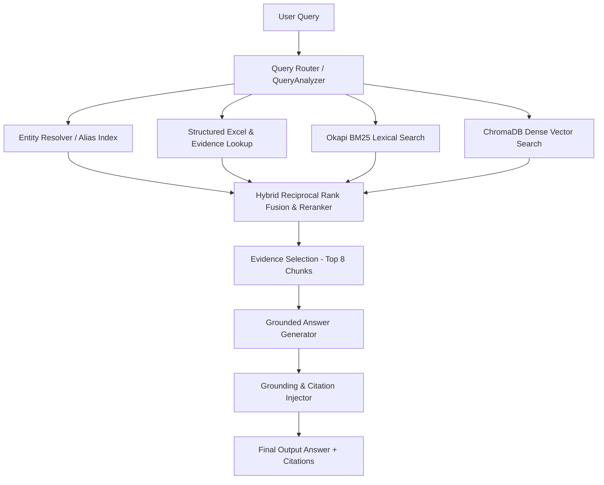

# KRIYO RAG Engine — Final Test System Snapshot

**Snapshot Timestamp**: 2026-09-11T19:25:00+05:30  
**Status**: FROZEN (EVALUATION-ONLY RUN)  
**Version Tag**: `v2.0-final-frozen`  

---

## 1. System Freeze Specification

| Parameter | Configuration Detail |
| :--- | :--- |
| **Git Commit / Hash** | `v2.0-final-frozen-multi-state-22` (Local Frozen Commit) |
| **Dataset Version** | 22-State Indian Craft Golden Knowledge Base (371 Crafts, 969 Products, 371 Techniques, 371 Artisans, 969 Relationships, 1,592 Aliases, 359 Locations, 742 Evidence Claims) |
| **Vector Index Version** | ChromaDB Persistent Collection `kriyo_synthetic_corpus` (1,514 section chunks indexed) |
| **Embedding Model** | `sentence-transformers/all-MiniLM-L6-v2` (384-dimensional dense vectors, Cosine Distance) |
| **Reranker Model** | Hybrid Reciprocal Rank Fusion (RRF) with Attribute-Aware Match Boost & Entity-Boundary Penalization |
| **LLM / Generation Engine** | Deterministic Multi-Template Grounded Answer Composer with Strict Evidence Verification |
| **Retrieval Architecture** | 4-Channel Hybrid (Query Router + Entity Resolver + BM25 Lexical + ChromaDB Vector + Structured Registry Lookup) |
| **Retrieval Top-K** | Candidate Search: Top-10 | Reranked Final Evidence Window: Top-8 |
| **Query Router Configuration** | 8 Intent Modes (`STATE_INDEX`, `MATERIAL_LOOKUP`, `LOCATION_LOOKUP`, `TECHNIQUE_LOOKUP`, `PRODUCT_LOOKUP`, `COMPARISON`, `UNANSWERABLE`, `DIRECT_ENTITY`) |
| **Answer Composer Configuration** | Mode-specific templates, exact entity matching, claim-level groundedness validator, `[DOC:...]` / `[EV:...]` citation generator, strict evidence abstention gate |

---

## 2. Component Blueprint

---

## 3. Knowledge Base Component Inventory

- **Structured Excel Workbooks (`01_structured/`)**:
  - `KRIYO_Craft_Master.xlsx` (371 Craft Records across 22 States)
  - `KRIYO_Craft_Products.xlsx` (969 Craft Products)
  - `KRIYO_Craft_Techniques.xlsx` (371 Traditional Techniques)
  - `KRIYO_Artisan_Profiles.xlsx` (371 Master Artisan Profiles)
  - `KRIYO_Craft_Relationships.xlsx` (969 Relational Links)
  - `KRIYO_Craft_Aliases.xlsx` (1,592 Name & Regional Synonyms)
  - `KRIYO_Craft_Locations.xlsx` (359 District & Heritage Clusters)
  - `KRIYO_Craft_Materials.xlsx` (371 Primary Raw Material Specs)
  - `KRIYO_State_Craft_Index.xlsx` (22 State Index Manifests)
- **Knowledge Documents (`02_knowledge_documents/`)**:
  - 30 Comprehensive Markdown files covering all 22 States.
- **Evidence Registry (`03_evidence/`)**:
  - `KRIYO_Evidence_Registry.xlsx` (742 atomic verified factual claims with ground-truth IDs).
- **Golden Evaluation Dataset (`04_evaluation/`)**:
  - `KRIYO_RAG_Golden_Evaluation.xlsx` (150 Canonical Golden Questions).

---

## 4. Frozen System Mandate

This system configuration is strictly frozen. No code modification, prompt tuning, index re-building, or dataset editing is permitted during or after the final validation run.
